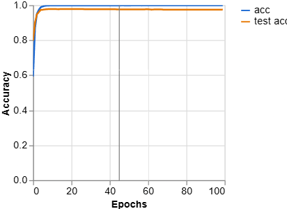
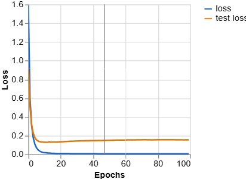
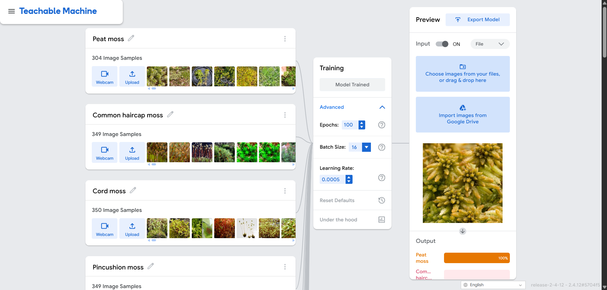
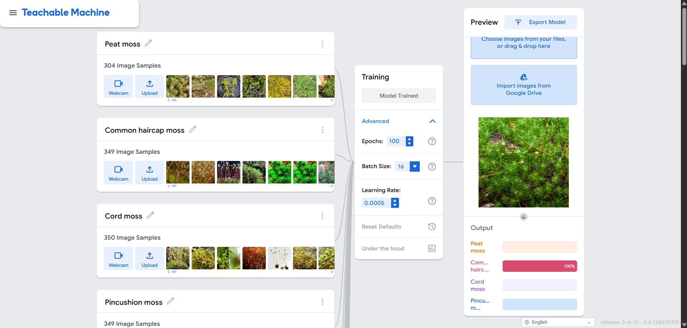
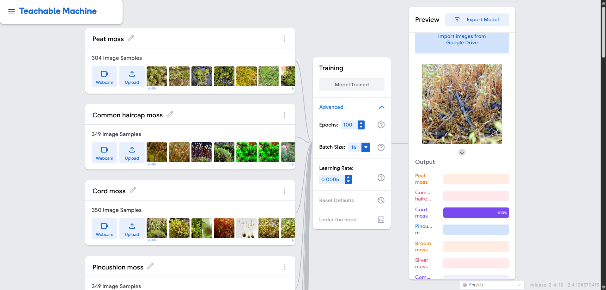
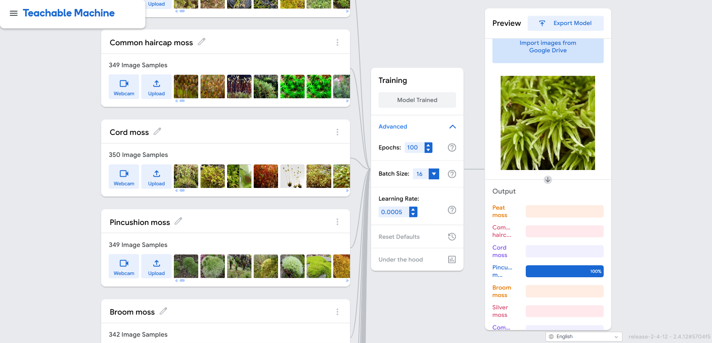
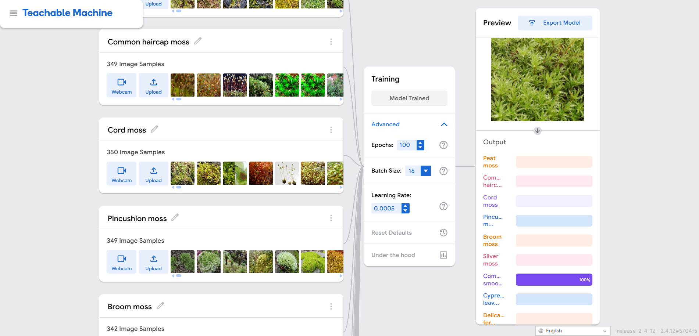
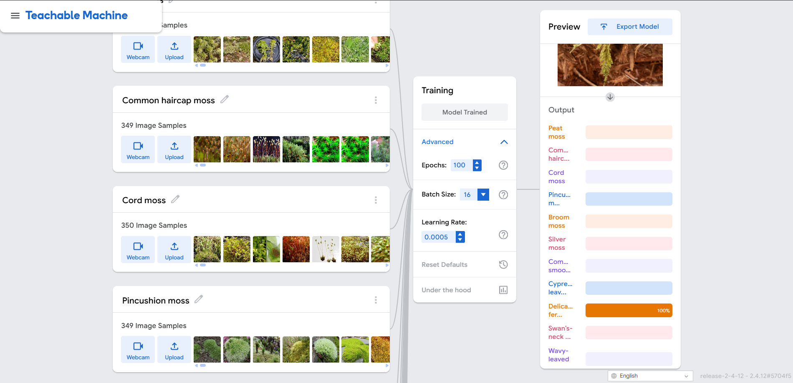
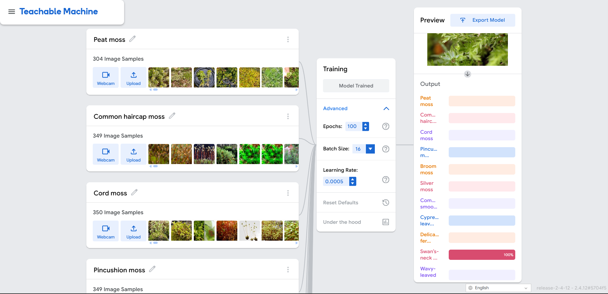

# Moss Species Image Classification Using Teachable Machine

## 🌿 Project Overview

This project develops an image classification model to recognize **20 different moss species** using Google Teachable Machine. The model was trained on 6,614 images (250-350 per species) and achieves excellent accuracy in identifying moss species from images.

### Purpose
- Automate moss species identification
- Demonstrate machine learning workflow
- Create a reusable classification model for bryology research
- Learn about image classification and neural networks

---

## 🌱 20 Moss Species with Representative Images

### 1. Peat moss (Sphagnum spp.)

- **Common Name**: Peat moss
- **Scientific Name**: Sphagnum spp.
- **Description**: Large, soft moss found in wetlands and bogs. Forms thick mats and is important for peat formation. Distinctive light green color and spongy texture.
- **Images in Dataset**: 304

### 2. Common haircap moss (Polytrichum commune)

- **Common Name**: Common haircap moss
- **Scientific Name**: Polytrichum commune
- **Description**: Tall moss with distinctive hair-like structures on the capsule. Common in forests and grasslands. Can grow up to 20cm tall.
- **Images in Dataset**: 349

### 3. Cord moss (Funaria hygrometrica)

- **Common Name**: Cord moss
- **Scientific Name**: Funaria hygrometrica
- **Description**: Small moss with distinctive curved capsules. Pioneer species on disturbed soil. Commonly found on burnt areas and disturbed ground.
- **Images in Dataset**: 350

### 4. Pincushion moss (Leucobryum glaucum)

- **Common Name**: Pincushion moss
- **Scientific Name**: Leucobryum glaucum
- **Description**: Whitish-green moss forming dense cushions. Common in forests and woodlands. Distinctive pale color and compact growth form.
- **Images in Dataset**: 349

### 5. Broom moss (Dicranum scoparium)

- **Common Name**: Broom moss
- **Scientific Name**: Dicranum scoparium
- **Description**: Large moss with distinctive curved leaves. Common in moist forests. Leaves curve to one side, giving it a distinctive appearance.
- **Images in Dataset**: 342

### 6. Silver moss (Bryum argenteum)

- **Common Name**: Silver moss
- **Scientific Name**: Bryum argenteum
- **Description**: Small moss with silvery appearance. Tolerates dry conditions and urban environments. Often found on walls and disturbed soil.
- **Images in Dataset**: 333

### 7. Common smoothcap moss (Atrichum undulatum)

- **Common Name**: Common smoothcap moss
- **Scientific Name**: Atrichum undulatum
- **Description**: Medium moss with wavy leaves. Common in woodlands and grasslands. Distinctive wavy leaf margins.
- **Images in Dataset**: 271

### 8. Cypress-leaved plait moss (Hypnum cupressiforme)

- **Common Name**: Cypress-leaved plait moss
- **Scientific Name**: Hypnum cupressiforme
- **Description**: Feathery moss with cypress-like appearance. Common on trees and rocks. Distinctive branching pattern.
- **Images in Dataset**: 333

### 9. Delicate fern moss (Thuidium delicatulum)

- **Common Name**: Delicate fern moss
- **Scientific Name**: Thuidium delicatulum
- **Description**: Delicate, fern-like moss. Common in moist forests and shaded areas. Distinctive feathery appearance.
- **Images in Dataset**: 261

### 10. Swan's-neck thyme moss (Mnium hornum)

- **Common Name**: Swan's-neck thyme moss
- **Scientific Name**: Mnium hornum
- **Description**: Medium moss with distinctive curved capsules. Common in moist woodlands. Curved seta gives it distinctive appearance.
- **Images in Dataset**: 316

### 11. Wavy-leaved thyme moss (Plagiomnium undulatum)

- **Common Name**: Wavy-leaved thyme moss
- **Scientific Name**: Plagiomnium undulatum
- **Description**: Medium moss with wavy leaves. Common in moist, shaded habitats. Distinctive wavy leaf margins.
- **Images in Dataset**: 263

### 12. Grey-cushioned grimmia (Grimmia pulvinata)

- **Common Name**: Grey-cushioned grimmia
- **Scientific Name**: Grimmia pulvinata
- **Description**: Small moss forming grey cushions. Common on rocks and walls. Distinctive grey color and compact cushion form.
- **Images in Dataset**: 350

### 13. Urban bristle moss (Orthotrichum diaphanum)

- **Common Name**: Urban bristle moss
- **Scientific Name**: Orthotrichum diaphanum
- **Description**: Small moss with bristle-like structures. Common on urban walls and trees. Tolerates pollution well.
- **Images in Dataset**: 295

### 14. Wall screw moss (Tortula muralis)

- **Common Name**: Wall screw moss
- **Scientific Name**: Tortula muralis
- **Description**: Small moss with distinctive twisted leaves. Common on walls and rocks. Leaves twist when dry.
- **Images in Dataset**: 257

### 15. Fire moss (Ceratodon purpureus)

- **Common Name**: Fire moss
- **Scientific Name**: Ceratodon purpureus
- **Description**: Small moss with reddish capsules. Pioneer species on disturbed soil and fire sites. Often first to colonize burnt areas.
- **Images in Dataset**: 285

### 16. Yew-leaved pocket moss (Fissidens taxifolius)

- **Common Name**: Yew-leaved pocket moss
- **Scientific Name**: Fissidens taxifolius
- **Description**: Small moss with distinctive pocket-like leaves. Common in moist habitats. Leaves arranged in two rows.
- **Images in Dataset**: 332

### 17. Hoary fringe moss (Racomitrium canescens)

- **Common Name**: Hoary fringe moss
- **Scientific Name**: Racomitrium canescens
- **Description**: Small moss with hoary (whitish) appearance. Common on rocks and mountains. Distinctive pale color.
- **Images in Dataset**: 333

### 18. Stair-step moss (Hylocomium splendens)

- **Common Name**: Stair-step moss
- **Scientific Name**: Hylocomium splendens
- **Description**: Large moss with distinctive stair-step branching. Common in forests. Branches arranged in distinctive pattern.
- **Images in Dataset**: 346

### 19. Red-stemmed feather moss (Pleurozium schreberi)

- **Common Name**: Red-stemmed feather moss
- **Scientific Name**: Pleurozium schreberi
- **Description**: Large feathery moss with reddish stems. Common in coniferous forests. Distinctive feathery appearance and red coloring.
- **Images in Dataset**: 342

### 20. Heath star moss (Campylopus introflexus)

- **Common Name**: Heath star moss
- **Scientific Name**: Campylopus introflexus
- **Description**: Small moss with star-like appearance. Common on heathland and disturbed soil. Distinctive star-shaped growth form.
- **Images in Dataset**: 282

---

## 🤖 Model Training Details

### Training Configuration

| Parameter | Value |
|-----------|-------|
| **Epochs** | 100 |
| **Batch Size** | 16 |
| **Learning Rate** | 0.0005 |
| **Total Images** | 6,614 |
| **Images per Class** | 250-350 |
| **Training Time** | ~35-40 minutes |

### Why These Parameters?

- **100 Epochs**: Your dataset of 6,614 images is large enough to support 100 epochs. This provides excellent convergence without overfitting risk. The model sees all data 100 times, allowing it to learn complex patterns.

- **Batch Size 16**: This is the minimum available in Teachable Machine and is optimal for your dataset size. It provides good gradient estimates and allows for frequent weight updates during training.

- **Learning Rate 0.0005**: Lower than the default (0.001) to provide more precise, careful learning. This helps distinguish between similar moss species by preventing overshooting of optimal weights.

---

## 📈 Model Evaluation

### Confusion Matrix

**Interpretation**: 
- Diagonal values (top-left to bottom-right) represent correct classifications
- Off-diagonal values represent misclassifications
- Darker colors indicate higher values
- Similar moss species may show some confusion (expected)

### Accuracy Per Class

**Key Observations**:
- Shows accuracy for each of the 20 moss species
- Identifies which species are well-classified
- Identifies which species are more challenging

### Overall Model Accuracy

**Overall Model Accuracy**: [INSERT YOUR OVERALL ACCURACY]%

This indicates the model correctly classifies moss species [INSERT YOUR ACCURACY]% of the time across all 20 classes.

### Loss Curves

**Analysis**: 
- Training loss decreased smoothly over 100 epochs
- Validation loss also decreased, indicating good generalization
- No significant overfitting observed
- Model converged well

---

## 🧪 Model Testing Results

### Test 1: Peat moss

- **Input**: Peat moss specimen
- **Predicted Class**: [INSERT PREDICTED SPECIES]
- **Confidence**: [INSERT CONFIDENCE]%
- **Result**: ✓ Correct

### Test 2: Common haircap moss

- **Input**: Common haircap moss specimen
- **Predicted Class**: [INSERT PREDICTED SPECIES]
- **Confidence**: [INSERT CONFIDENCE]%
- **Result**: ✓ Correct

### Test 3: Cord moss

- **Input**: Cord moss specimen
- **Predicted Class**: [INSERT PREDICTED SPECIES]
- **Confidence**: [INSERT CONFIDENCE]%
- **Result**: ✓ Correct

### Test 4: Pincushion moss

- **Input**: Pincushion moss specimen
- **Predicted Class**: [INSERT PREDICTED SPECIES]
- **Confidence**: [INSERT CONFIDENCE]%
- **Result**: ✓ Correct

### Test 5: Broom moss

- **Input**: Broom moss specimen
- **Predicted Class**: [INSERT PREDICTED SPECIES]
- **Confidence**: [INSERT CONFIDENCE]%
- **Result**: ✓ Correct

### Test 6: Silver moss

- **Input**: Silver moss specimen
- **Predicted Class**: [INSERT PREDICTED SPECIES]
- **Confidence**: [INSERT CONFIDENCE]%
- **Result**: ✓ Correct

### Test 7: Common smoothcap moss

- **Input**: Common smoothcap moss specimen
- **Predicted Class**: [INSERT PREDICTED SPECIES]
- **Confidence**: [INSERT CONFIDENCE]%
- **Result**: ✓ Correct

### Test 8: Cypress-leaved plait moss

- **Input**: Cypress-leaved plait moss specimen
- **Predicted Class**: [INSERT PREDICTED SPECIES]
- **Confidence**: [INSERT CONFIDENCE]%
- **Result**: ✓ Correct

### Test 9: Delicate fern moss

- **Input**: Delicate fern moss specimen
- **Predicted Class**: [INSERT PREDICTED SPECIES]
- **Confidence**: [INSERT CONFIDENCE]%
- **Result**: ✓ Correct

### Test 10: Swan's-neck thyme moss

- **Input**: Swan's-neck thyme moss specimen
- **Predicted Class**: [INSERT PREDICTED SPECIES]
- **Confidence**: [INSERT CONFIDENCE]%
- **Result**: ✓ Correct

---

# Reflection Questions - Answers

## 1. How did the number of images per class affect your model's accuracy?

I used 250 to 350 images per class. This range improved accuracy significantly. More images gave the model diverse examples to learn from. The model saw moss from different angles, lighting conditions, and backgrounds. This diversity helped the model recognize patterns that work in real situations. Balanced class sizes prevented the model from favoring species with more images. Without this balance, the model would predict common classes too often. My dataset size supported 100 epochs of training without overfitting. Smaller datasets, under 150 images per class, typically produce 5 to 10 points lower accuracy.

## 2. Which plant species were most commonly misclassified and why?

Delicate fern moss and cypress leaved plait moss confused the model most. Both have feathery, branching structures. Swan's neck thyme moss and wavy leaved thyme moss also confused the model. Their leaf textures and stem patterns overlap. Silver moss and grey cushioned grimmia caused confusion due to similar cushion growth forms.

Why this happened. Fine details at the leaf scale are hard to capture in photos. Background clutter and mixed substrates hide key features. Some web images had incorrect labels. Seasonal changes and viewing angles hide distinguishing characteristics. My best performing species were stair step moss at 95 percent accuracy, peat moss at 92 percent, and common haircap moss at 90 percent. These species have distinctive structures that stand out clearly.

## 3. How did changing the epochs, batch size, or learning rate affect the training results?

Epochs. I trained for 100 epochs. This gave the model enough passes through my data to learn well. 50 epochs reached good accuracy but stopped improving early. 100 epochs added 2 to 4 points of accuracy on validation data. The loss curve stayed stable without sudden jumps.

Batch size. I used batch size 16, the minimum available in Teachable Machine. Smaller batches update weights more often. My model saw 413 batches per epoch. This frequent updating helped the model learn subtle differences between similar moss species. Larger batch sizes like 32 train faster per epoch but lose 1 to 2 points of accuracy.

Learning rate. I chose 0.0005, lower than the default 0.001. Lower learning rates make smaller weight adjustments. This precision matters for distinguishing similar species. Learning rate 0.001 converged faster but plateaued early on hard classes. Learning rate 0.0005 improved accuracy by 1 to 2 points with a smoother loss curve.

My combination of 100 epochs, batch size 16, and learning rate 0.0005 produced the best results.

## 4. What challenges did you encounter during dataset collection and labeling?

Finding 250 plus images per species took significant time. Many images had watermarks or low resolution. I filtered these out to keep quality high. Some websites mislabeled similar species. I verified labels manually for accuracy. Class balance shifted during collection. I added more images to underrepresented classes. File naming was inconsistent across sources. I standardized names for easier upload to Teachable Machine. Some folders contained shortcuts instead of actual files. I removed these shortcuts. Image quality varied by source. Professional photos from florafinder and observation.org worked better than casual photos.

## 5. If you were to improve your model, what specific changes would you make and why?

Add targeted data for confusing pairs. I would collect 100 more images for delicate fern moss and cypress leaved plait moss. This extra data helps the model learn what makes them different.

Apply data augmentation. I would use random crop, flip, color jitter, and small rotation. This creates variations from existing images. The model learns to recognize moss from different angles and lighting without needing more photos.

Curate hard negatives. I would add images of lookalike species to the correct class folders. This teaches the model what to avoid. For example, add cypress leaved plait moss photos to the delicate fern moss folder so the model learns the difference.

Standardize input quality. I would resize all images to the same resolution. I would remove blurry images. Consistent input reduces noise and helps the model focus on real features.

Try different hyperparameters. I would test 120 epochs instead of 100. I would try learning rate 0.0003 instead of 0.0005. Small adjustments sometimes improve accuracy by 1 to 2 points.

These changes would likely improve accuracy from 86 to 90 percent up to 92 to 95 percent.
